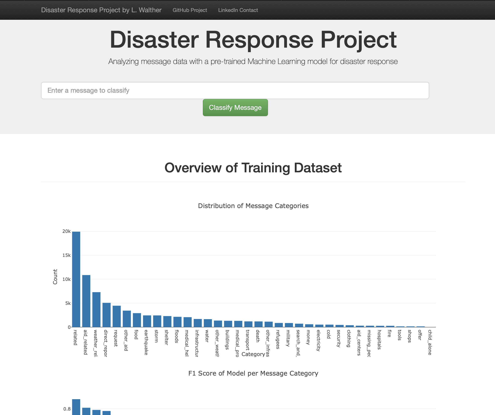
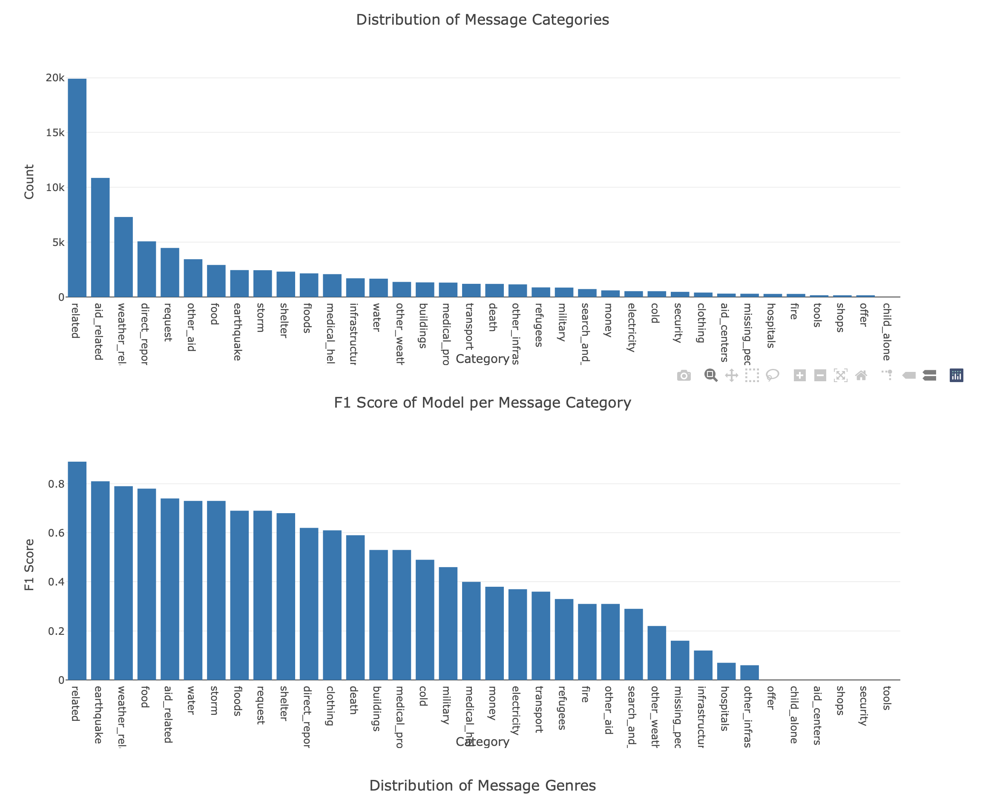

# ML_Disaster_Response_Pipeline
A Machine Learning Pipeline to categorize emergency messages based on the needs communicated by the sender. Project includes Flask Web Application.



### Table of Contents

1. [Instructions](#instructions)
2. [Project Motivation](#motivation)
3. [File Descriptions](#files)
4. [Results](#results)
5. [Licensing, Authors, and Acknowledgements](#licensing)

## Instructions: <a name="instructions"></a>

The project was created with Python 3.8.0.
Run the following commands to initiate thw project:

1. create virtual environment in folder **ML_Disaster_Response_Pipeline/**:

  `python3 -m venv disaster_response_env`

2. activate the virtual environment:

  `source disaster_response_env/bin/activate`

3. pip install required packages:

  `pip install -r requirements.txt`

4. change directory to **ML_Disaster_Response_Pipeline**:

  `cd ML_Disaster_Response_Pipeline6.

5. Run ETL pipeline that cleans data and stores in database:

  `python data/process_data.py data/disaster_messages.csv data/disaster_categories.csv data/DisasterResponse.db`

7. Run ML pipeline that trains classifier and saves

  `python models/train_classifier.py data/DisasterResponse.db models/classifier.pkl`

8. Run the following command in the app's directory to run your web app.
    `python run.py`

9. Go to local host:
 http://0.0.0.0:3001/


## Project Motivation: <a name="motivation"></a>

Motivation of this project is to implement a machine learning pipeline
including Natural Language Processing using the Python Scikit-Learn library.
This corporate message data is from one of the free datasets provided on the
[Figure Eight Platform](https://appen.com/resources/datasets/), licensed under
a [Creative Commons Attribution 4.0 International License](https://creativecommons.org/licenses/by/4.0/).


## File Descriptions: <a name="files"></a>
The project contains the following files:

```
ML_Disaster_Response_Pipeline/
│
├── README.md
├── requirements.txt
├── LICENSE
├── app/
│   ├── template/
│   │   ├── master.html  # main page of web app
│   │   ├── go.html  # classification result page of web app
│   │
│   ├── template/
│   │   ├── figures.py  # script to create python figures
│   ├── run.py  # Flask file that runs app
│
├── data/
│   ├── disaster_categories.csv  # data to process
│   ├── disaster_messages.csv  # data to process
│   ├── process_data.py
│   ├── DisasterResponse.db   # database to save clean data to
│
├── models/
│   ├── train_classifier.py
│   ├── classifier.pkl  # saved model

```


## Results: <a name="results"></a>

#### Data Cleaning:
The process_data.py script loads the disaster_categories.csv and
disaster_messages.csv files. The data of both csv's is merged into one dataframe.
In the next step the category columns are transformed so that the column names
fit the categories and the cells only contain values zero or one, meaning
true or false. Rows containing values higher than one are dropped.

#### Imbalance of data and resulting f1 score:
As visible in the visualization of the Web Application the input data containing
the messages is imbalanced regarding the categories of the tweets. There are
19906 messages categorized as "related", 10860 "aid related" and 7297 "weather
related". On the other extreme there are only 298 messages categorized as
"missing people" and 724 "search and rescue".
This results into relatively high f1 scores for classifying messages of the
categories with more examples in the training and test data and a bad
performance for those categories with few examples int the training and test
data.



## Licensing, Authors, Acknowledgements: <a name="licensing"></a>

This corporate message data is from one of the free datasets provided on the
[Figure Eight Platform](https://appen.com/resources/datasets/), licensed under
a [Creative Commons Attribution 4.0 International License](https://creativecommons.org/licenses/by/4.0/).

Feel free to use my code as you please:

Copyright 2020 Leopold Walther

Permission is hereby granted, free of charge, to any person obtaining a copy of this software and associated documentation files (the "Software"), to deal in the Software without restriction, including without limitation the rights to use, copy, modify, merge, publish, distribute, sublicense, and/or sell copies of the Software, and to permit persons to whom the Software is furnished to do so, subject to the following conditions:

The above copyright notice and this permission notice shall be included in all copies or substantial portions of the Software.

THE SOFTWARE IS PROVIDED "AS IS", WITHOUT WARRANTY OF ANY KIND, EXPRESS OR IMPLIED, INCLUDING BUT NOT LIMITED TO THE WARRANTIES OF MERCHANTABILITY, FITNESS FOR A PARTICULAR PURPOSE AND NONINFRINGEMENT. IN NO EVENT SHALL THE AUTHORS OR COPYRIGHT HOLDERS BE LIABLE FOR ANY CLAIM, DAMAGES OR OTHER LIABILITY, WHETHER IN AN ACTION OF CONTRACT, TORT OR OTHERWISE, ARISING FROM, OUT OF OR IN CONNECTION WITH THE SOFTWARE OR THE USE OR OTHER DEALINGS IN THE SOFTWARE.
